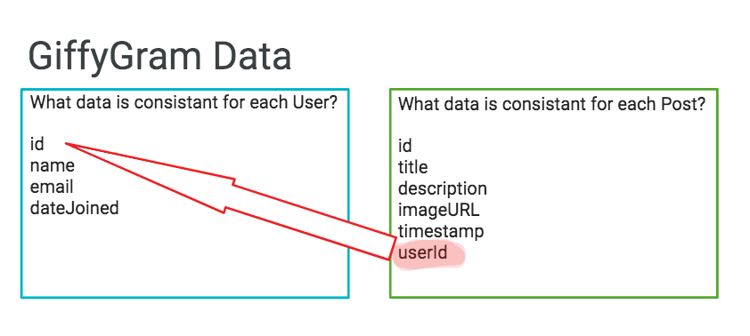

# Start with the Data

Before you write **ANY** code for an application, you need to understand the types of data _(i.e. resources)_ you are working with, the properties of each resource, and how the resources are related to each other. All of the code you will write is dependent upon the data. Once you have started building the application, the more progress you make, the more expensive it is - in both time and money - to make changes to the structure of the data.

In this chapter, you are going to build a visualization of the data and how resources relate to each other.

## Learning Objectives
You should be able to:
* state the purpose of an ERD
* define what is a resource for an application
* remember that an ERD shows properties and relationships

## Application Resources

An Entity Relationship Diagram (ERD) is a tool for software developers to visualize the resources for an application and how they relate.

What is a resource? It is the kind of data your users will view,create, delete, or update in your application.

For Giffygram, here is the list of the main resources that need to be represented in your code.

1. Users - People who use the application.
1. Posts - People will create new posts with animation GIFs in them.
1. Messages - People will send messages to other users of the application.

Additionally, a major feature of this application is that users should have the ability to like posts from other users, just as you see on the major social media platforms.

To visualize these resources and relationships, you are going to be using a diagramming tool called [DBDiagram](https://dbdiagram.io/).


## ERD Table Definitions

Each resource in an application gets a table. For GiffyGram, we will start with tables for users, posts, messages.

When building the table, consider what does one "user" or "post" look like. What are the properties? Also, each entry will have a unique id.



Open DBDiagram and create a table for users and posts. You can past the following definitions into the left panel.

```ddl
Table users {
  id int [pk]
  name varchar
  email varchar
  dateJoined date
}

Table posts {
  id int [pk]
  title varchar
  description varchar
  imageURL date
  timestamp date
  userId int [ref: > users.id]
 }

```

 ### Practice Messages Table
 Create a table for messages. What are the properties associated with a single message? How do you connect messages to users and recipients? Share your diagram with a member of the instruction team.

 ### Practice Journal ERD
 Create an ERD for your journal. One of the resources should be the journal entry. Define the properties. When creating the table, consider: what does one journal entry look like? Also, are there any other resources you should define? Once you have the ERD, share your diagram with a member of the instruction team.
