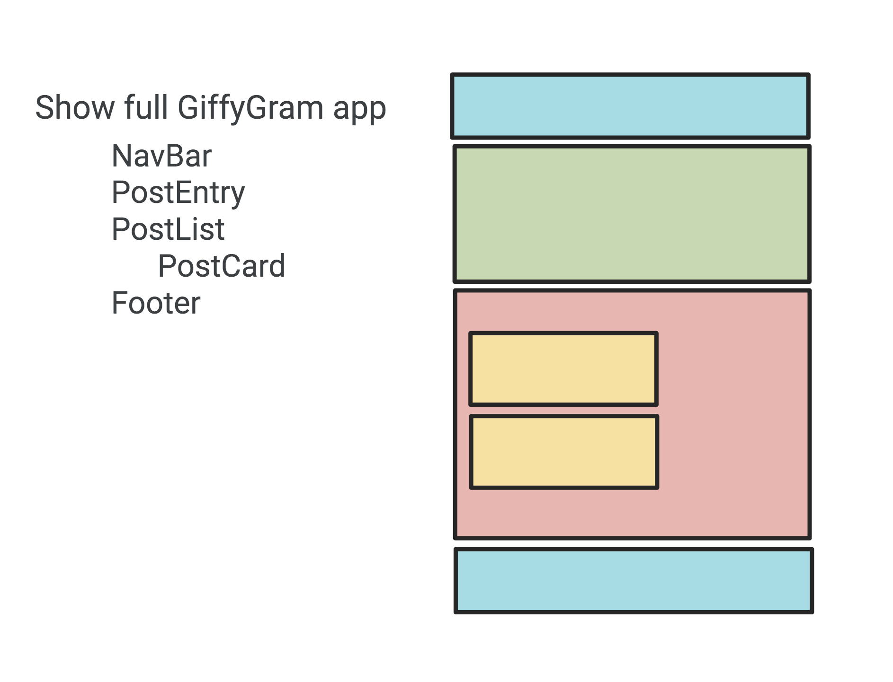

# Posts List and Cards

## Learning Objectives
You should be able to:

* describe how functions get exported and imported into different modules
* differentiate between assignment with a single `=` and appending with `+=`





Consider what we did in Martin's Aquarium to display the fish. We needed a FishList component and a Fish (card) component. `Main.js` will import the list. The list will display the cards.

### Create the HTML Representation of a single post

> #### `src/scripts/feed/Post.js
```js

  export const Post = (postObject) => {
    return `
      <section class="post">
        <header>
            <h2 class="post__title">${postObject.title}</h2>
        </header>
        
      </section>
    `
  }
```

### Create the list module.
This module accepts an array of posts and builds up the HTML representation of the posts.


> #### `src/scripts/feed/PostList.js
```js
import { Post } from "./Post.js";

export const PostList = (allPosts) => {
	let postHTML = "";
		//Loop over the array of posts and for each one, invoke the Post component which returns HTML representation
		for (const postObject of allPosts) {
			//what is a postObject?
			postHTML += Post(postObject)
		}
		return postHTML;
	
}

```

Both of these components do one thing really well - Single Responsibility.

Since `main.js` runs the show let's create and invoke functions that will 
1. Get the post data from the `DataManager`
2. Display the list of posts with `PostList`

> #### `giffygram/src/scripts/main.js`

```js
// Can you explain what is being imported here?
import { getPosts, getUsers } from "./data/DataManager.js"


const showPostList = () => {
  const postElement = document.querySelector(".postList");
	getPosts().then((allPosts) => {
		postElement.innerHTML = PostList(allPosts);
	})
}


const startGiffyGram = () => {
	showPostList();
}

startGiffyGram();
```

Start your Web server with the serve command in the terminal. Make sure you are in the giffygram/src directory when you do it. View your app in the browser.


## Displaying More Properties as HTML

In the next couple chapters, you will see more comprehensive code for displaying the properties of a Post as HTML, but you are encouraged to give it a shot first.

Open `src/scripts/feed/Post.js` and add more HTML structure, and interpolate the `description`, `timestamp`, and/or the `userId` property in it.

## Practice Journal
Try putting these steps together to display your journal entries in a list. You may need to refactor your code to follow the pattern.