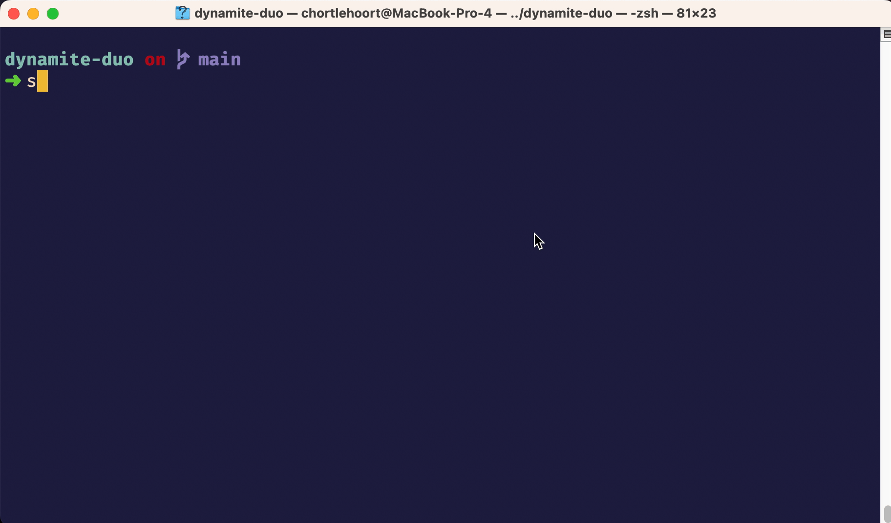
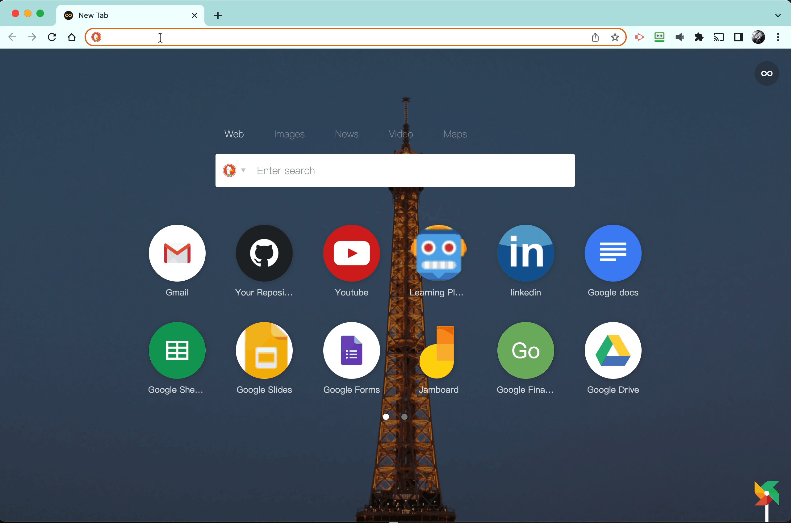
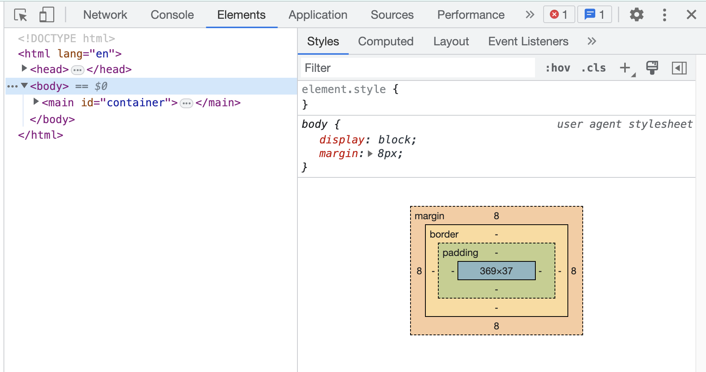

# Power to the Developer

The developer tools of the browser is where you, as a developer, look at the evidence of what is happening in main browser window where the HTML is rendered. It is where you will spend most of your time when diagnosing problems, working with CSS, and debugging your code.

> Your DevTools should be open **all the time** while working on a project.

Time to get started.

## Loading Your HTML

In your terminal, make sure you are in the `dynamite-duo` directory.

Open the directory in Visual Studio code with the following command. A single dot `.` in a shell environment mean _"current directory"_.

```sh
code .
```

Right now, your `index.html` file doesn't have any content to display, so you can start off with some standard HTML. Copy pasta the following HTML into that file.

```html
<!DOCTYPE html>
<html lang="en">
<head>
    <meta charset="UTF-8">
    <meta http-equiv="X-UA-Compatible" content="IE=edge">
    <meta name="viewport" content="width=device-width, initial-scale=1.0">
    <title>Dynamite Duo</title>
</head>

<body>
    <main id="container">
        <h1>The Dynamite Duo</h1>
    </main>

    <script type="module" src="./scripts/main.js"></script>
</body>
</html>
```

Then go back to your terminal and type in the `serve` command. This starts a simple web server that will load the contents of your `index.html` file into browser.

It should give you the output below. If you don't see this, talk to an instructor for guidance.



In that output, you will see a **Local:** URL that you can go to in your browser. Type `localhost:3000` in the URL bar of the browser and you should see **The Dynamite Duo** appear.



## Developer Tools: Elements

Now you can look at your developer tools for the first time. You can open them in a couple ways.

1. Right-click anywhere in the browser and choose the **Inspect** option in the menu that appears.
2. On a Mac, the key combo of pressing **Option+Command+J** at the same time.
3. On Windows, the key combo of pressing **Control+Shift+C** at the same time.

When your developer tools are open, there are several panels listed at the top. Make sure you are on the **Elements** panel.



This is where you will inspect the structure of your DOM _(Document Object Model)_ and view the CSS used for styling the document.

## Learn More

Take a few minutes and read the official [Open Chrome DevTools](https://developer.chrome.com/docs/devtools/open/) article published by the Chrome team to learn more about the basics of the DevTools.
