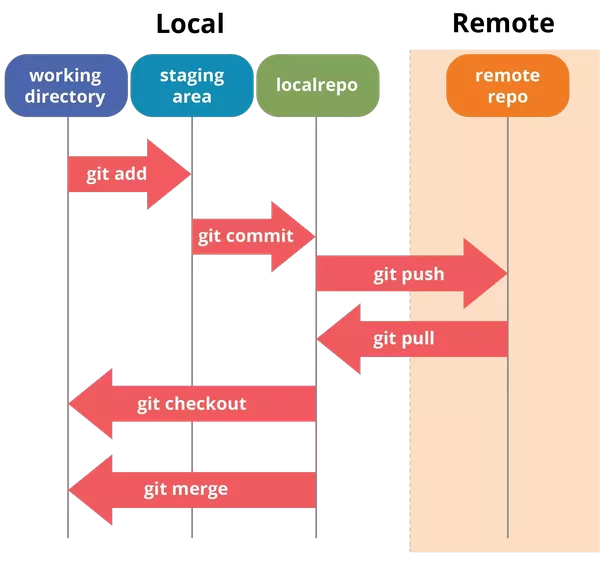

# Git Basics

This visualization is going to be a key resource for you and your teams as you go through the course. It is highly recommended that you keep coming back to this chapter and have this image open in a browser tab every time you work with git until you are comfortable with the process.



## Status

The `git status` command is your BFF when working with git. It will always tell you the current status of your code. There is no such thing and typing `git status` too many times.

As a professional developer, I use `git status` nearly 100% of the time when I'm working through the process of changing and committing code to history.

## Staging a Commit

As you work on your files, git will immediately mark them as changed. Remember, the main purpose of git is to track changes to your code.

#### Check the current status of your files.

```sh
git status
```

When you feel that your code is working and ready to be saved as an official version in the history of the project, you first need to add the files to a staging area. It is your way to tell git, "out of the all the files I've changed, here are the ones that I want to officially commit to history."

> Do not put curly braces around your file name.
>
> Do not put curly braces around your file name.

To add files to the staging area, you use the `git add {filename}` command.

If, for example, you have changed both the `index.html` file and the `styles/main.css` file, but you only want to commit the CSS file, you would use the following command.

```sh
git add styles/main.css
```

 If you want to stage the HTML file, you would use the following command.

```sh
git add index.html
```

#### Check the current status of your files.

```sh
git status
```


## Commit to History

Once all of the files have been added to the staging area, it's time to officially commit them with the following command.

The `-m` flag in the command is important so that you, as the author, can leave a descriptive message about the changes you just made.

```sh
git commit -m "My first version of my aquarium code"
```

> _Beginner Hint!_ If you accidentally type `git commit` and hit enter without the `-m` and the message, you'll be taken to a screen that will make you feel like Alice through the looking glass. If this happens, for now just come see an instructor and we'll get you back to reality safely.

#### Check the current status of your files.

```sh
git status
```

Now you can create a Github repository where you will upload your code.

## Backing Up and Sharing Code on Github

Github is a _software as a service_ (SAAS) that allows you to back up your repository to the cloud and share it with other software developers. Note that it is not the same thing as git, which is an application you are running locally on your machine. Github and git are made to talk to each other, but they are separate entities.

## Pushing to Github

When you are ready to share your code with your teammates, or the general public, you can push your repository to Github. Think of Github as an external drive you plug into your laptop to use as backup. Instead of it backing up the entire hard drive, you will back things up, one project at a time, only when you want to.

The first thing you need to do is create a new repository on Github's platform that you will use to backup the code on your laptop.

### Create Github Repo

1. Log into your Github account.
1. Click the `+` sign in the top right corner.
1. Choose "New repository".
1. In the "Repository name" field, enter in `nss-aquarium`.
1. Scroll down and click the green "Create Repository" button.
1. **Make sure the SSH button is selected**, and copy the repository's connection string.
    
1. In your terminal, in the Martin's Aquarium directory, enter in the following commands.
    ```sh
    git remote add origin {paste what you copied above, but not these curly braces}
    git branch -M main
    git push -u origin main
    ```

Now that the code has successfully been backed up, go back to your browser, and refresh the page. You will see that your remote repository backup now has your aquarium HTML, JavaScript and CSS files in it.


## Practice: Backup Exercise

* Create a Github repository for the Congressional Representative exercise, and push up that code.
* Create a Github repository for the Coffee Houses exercise, and push up that code.

When you are done, you should have three new repositories in your Github account.

1. Aquarium
1. Coffee Houses
1. Congressional Representative

> **Tip:** If you have any issues getting your code onto Github, see a member of your instructional team immediately so that you have a backup of your code. Pushing your code to Github is not optional. It's a required part of this program.
