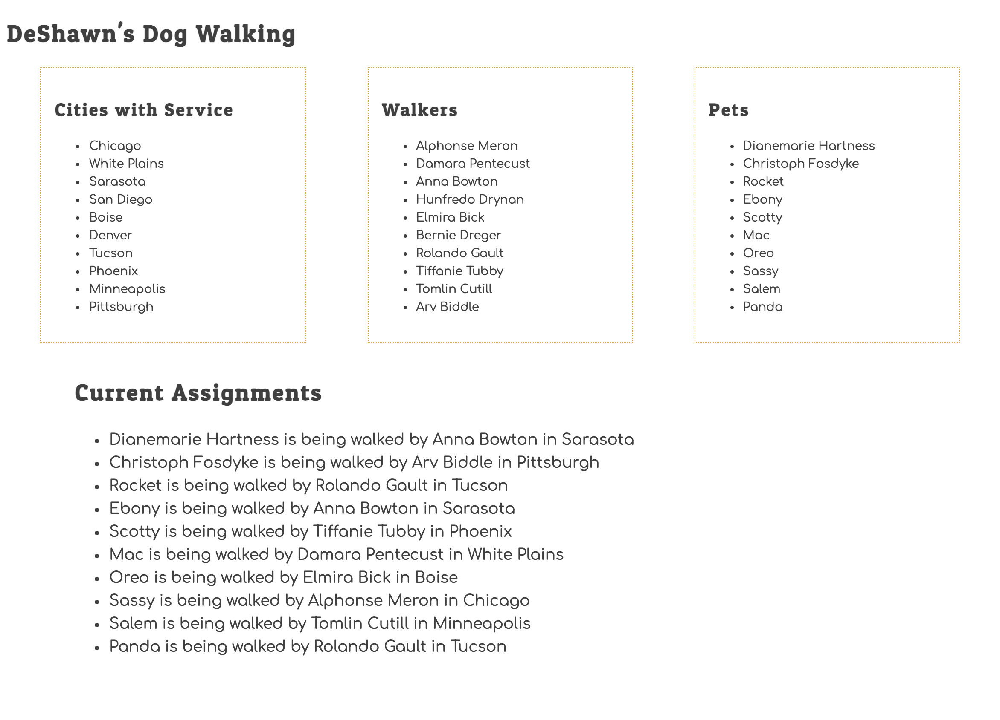

# Fixing DeShawn's Application

DeShawn hired some consulting agency from overseas to build a simple application that displayed the following information.

1. A list of cities where his service is provided.
1. A list of dog walkers that are currently working for him.
1. A list of pets that are currently being given walks by his employees.
1. A full list of current assignments.

Unfortunately, the overseas developer had an unfortunate noodle-related accident, and the only version that DeShawn has is filled with bugs. Your job is to fix the bugs.

Here's what the output of the application should look like.



## Setup

Run the following command in your terminal.

```sh
/bin/bash -c "$(curl -fsSL https://raw.githubusercontent.com/nashville-software-school/client-side-mastery/master/book-4-deshawns-dog-walking/chapters/scripts/deshawn-setup.sh)"
```

That script will create the `workspace/dog-walking` directory for you. Just `cd` to that directory and open it in Visual Studio Code.

## Dependency Graph

You are required to have a dependency graph for every project, and in this book, the graph becomes a bit more complex as there are many modules. Your working memory will be stretched, which is why the visual representations are very important.

Examine all of the imports and exports that exist in this project and build a dependency graph for it. Once you are done, you can expand the hint below and see if yours matches.

<details>
    <summary>Expand when you are done</summary>

```mermaid
graph TD;
    main-->Walkers-->database;
    main-->CityList-->database;
    main-->Assignments-->database;
    main-->RegisteredPets-->database;
```
</details>

## Sequence Diagram

Here is the visual algorithm for the DeShawn's Dog Walking project when it first runs and generates the HTML that you see in the browser.

```mermaid
sequenceDiagram
    participant main
    participant Walkers
    participant CityList
    participant RegisteredPets
    participant Assignments
    participant Database
    main->>Walkers: I need the function reference for generating HTML for cities
    Walkers-->>main: Gladly.
    main->>CityList: I need the function reference for generating HTML for cities
    CityList-->>main: Sure! Here you go.
    main->>RegisteredPets: Provide the HTML generation function for pets
    RegisteredPets-->>main: Here is my wonderful RegisteredPets function.
    main->>Assignments: May I have the HTML generation function for assignments
    Assignments-->>main: Absolutely.
    Note right of main: Invoke CityList function
    CityList-->>Database: I need all the city objects
    Database-->>CityList: Here's a copy of them
    loop
        CityList->>CityList: Convert each object to an `<li>`
    end
    CityList-->>main: Here's all the generated HTML
    Note right of main: Invoke Walkers function
    Walkers-->>Database: I need all the walker objects
    Database-->>Walkers: Here's a copy of them
    loop
        Walkers->>Walkers: Convert each object to an `<li>`
    end
    Walkers-->>main: Here's all the generated HTML
    Note right of main: Invoke RegisteredPets function
    RegisteredPets-->>Database: I need all the pet objects
    Database-->>RegisteredPets: Here's a copy of them
    loop
        RegisteredPets->>RegisteredPets: Convert each object to an `<li>`
    end
    RegisteredPets-->>main: Here's all the generated HTML
    Note right of main: Invoke Assignments function
    Assignments-->>Database: I need all the assignment objects
    Database-->>Assignments: Here's a copy of them
    loop
        Assignments->>Assignments: Convert each object to an `<li>`
    end
    Assignments-->>main: Here's all the generated HTML
    Note right of main: Update the innerHTML of the <main> element in the DOM.
```

## Bugs to Fix

Time to fix the bugs that exist in this project.

Run the `serve` command in the project directory and open the provided URL in Chrome.

This table shows you how many bugs there are in each module.

| Main | CityList | Walkers | Assignments | CSS |
|---|---|---|---|---|
| 1 | 3 | 3 | 3 | 3 |

Refer to the videos in the previous chapter to use your Chrome Dev Tools, and the debugger to find and fix the issues.

Do not use any `console.log()` statements.