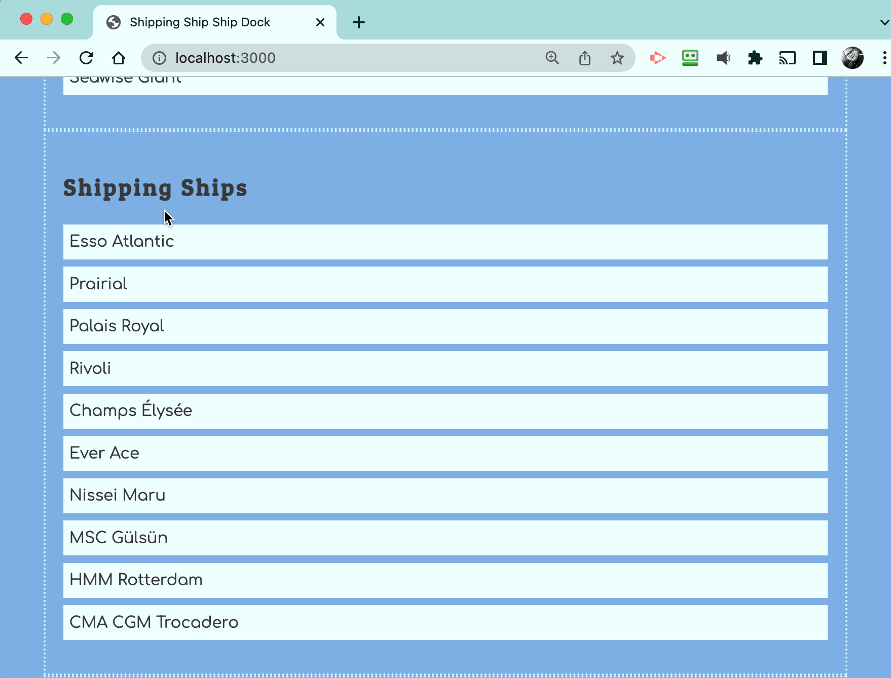

# Hauler Cargo

The next step for you is to add a click event listener that displays the hauler for each shipping ship.



## Handling Click Event

Add the following click event listener to the hauler list module and capture the DOM element that was clicked. The algorithm is included. Review it carefully.

```js
document.addEventListener(
    "click",
    (clickEvent) => {
        const itemClicked = clickEvent.target

        // Was a shipping ship list item clicked?

            // Get the haulerId value of the shipping ship clicked

            // Define a default object for the found hauler
            let haulingShip = { name: "Incorrect" }

            // Iterate the array of hauler objects

                // Does the haulerId foreign key match the id of the current hauler?

                    // Reassign the value of `haulingShip` to the current hauler

            // Show an alert to the user with this format...
            // Palais Royal is being hauled by Seawise Giant
    }
)
```

What information does this algorithm need to do its job?

* The type of item was clicked _(i.e. a shipping ship was clicked)_.
* The `haulerId` value of the shipping ship that was clicked.
* The name of the shipping ship that was clicked.
* The array of haulers so that it can be iterated.

Use data attributes on the shipping ship list items to make this data available to your JavaScript algorithm when a list item is clicked.
