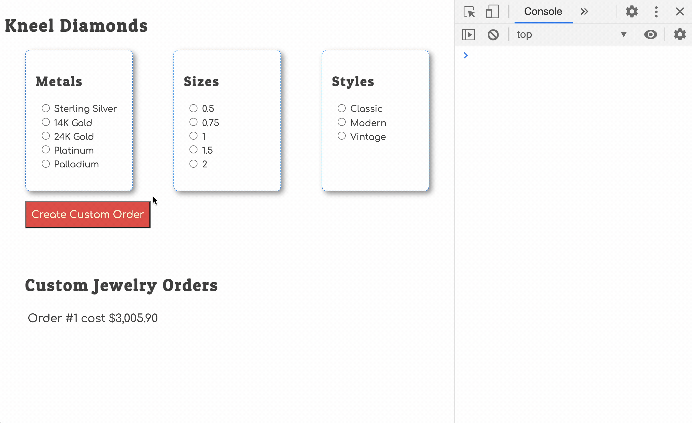

# Working for Kneel Diamonds

Kneel Diamonds is a jewelry store founded by James Kneel in 1937. It is currently owned and operated by his granddaughter Natasha Dimitrionov. It currently operates three physical locations around Nashville, TN and has 38 employees.

Natasha wants to expand her business to allow customers to commission works online, and have an online catalog of her existing inventory. A couple years ago, she figured she could do it herself, but her attempts quickly sputtered when she realized how difficult it was. She decided it was time to hire a professional developer to get it done correctly.

Your first day was yesterday. You completed all your paperwork, met everyone, and got all the software that you needed installed on one of their computers.

Today, you used your new key card to enter in through the back door, walked through the small kitchen and into the dark room off to the left in the back hallway. You flip on the lights and start your computer at 8:38 am.

> At 9:05, you hear the back door of the office open and hear Natasha's voice. She's discussing something with another person that arrived at the same time. Five minutes later, she briskly walks into your room, pulls up a chair next to you, crosses her legs and asks, "How are you this morning?"
>
> You tell her that you're fine and excited to build something.
>
> She nods and quickly gets to business.
>
> "I need you to build a web page with Java on it that lists all of the possible options that we offer to make custom jewelry. The user can choose any of the options, and a new code object should be created to represent their custom piece of jewelry. The customer can create as many jewelry items as she likes, add them to list of custom orders, and the Java code should be able to calculate the total cost."
>
> "You mean JavaScript, right?"
>
> She looks up at your sharply, narrows her eyes, and quips, "I remember trying to do this! It was Java. Just use it for this web page."
>
> You realize that it's not a battle worth fighting, shrug your shoulders, and say, "Ok. I need to know what all of the options are for the customer to choose from."
>
> She smiles quickly. You're not sure if there was a hint of smugness in that smile or not. She stands up and says, "I'll be back in just a minute."
>
> You hear her heels clicking down the hallway, then some shuffling, a metallic clang, and then the heels again as she makes her way back to your office. She bustles up to you and hands you a large, 3-ring binder. It has "Kneel Materials & Inventory" written on an index card, which has been taped to the front of the binder.
>
> "All of the metals, gems both precious and semi, colors, engravings, and styles for our jewelry is in there," her long index finger, tipped with a purple-painted nail, is extended towards the binder.

You spend the next several hours scouring all of the possible options, decide to start with custom rings, and finally write some JavaScript code that represents what is in the binder. You decide to price metals by the ounce.

```js
const metals = [
    { metal: "Sterling Silver", price: 12.42 },
    { metal: "14K Gold", price: 736.4 },
    { metal: "24K Gold", price: 1258.9 },
    { metal: "Platinum", price: 795.45 },
    { metal: "Palladium", price: 1241.0 }
]
```

Gems are a bit tricky, you discovered, as you read the information in the binder. Intead of price following a straightforward formula per caret, it increased as the caret got larger. A one carat stone costs more than double the cost of a half carat stone. Again, two carat stones will cost significantly more.

```js
const diamonds = [
    { carets: 0.5, price: 405 },
    { carets: 0.75, price: 782 },
    { carets: 1, price: 1470 },
    { carets: 1.5, price: 1997 },
    { carets: 2, price: 3638 }
]
```

Luckily, you find that Natasha prices styles with a consistent pattern. Classic band style costs the least, modern styles cost a bit more, and vitage style cost the most because they require the most detailing.

```js
const ringStyles = [
    { style: "Classic", price: 500 },
    { style: "Modern", price: 710 },
    { style: "Vintage", price: 965 }
]
```

## How Application Should Work

The following animation shows how the layout of the application, and how the user can select options and then click a button to generate a custom jewelry order. As soon as the order is generated, it should immediately appear in the DOM without refreshing the browser.

Up to this point, you've only handled "click" events. In this application, you will handle "change" events as well.



## Project Setup

Now that you have a paying job working for Kneel Diamonds, you are going to build out an application for producing different kinds of custom jewelry orders.

Run the following command in your terminal.

```sh
/bin/bash -c "$(curl -fsSL https://raw.githubusercontent.com/nashville-software-school/client-side-mastery/cohort-49/book-4-kneel-diamonds/chapters/scripts/kneel-diamonds-setup.sh)"
```

It will create the following directory for your project and provider some boilerplate code. Once it is complete, move on to the next chapter.

```sh
~/workspace/kneel-diamonds
```
