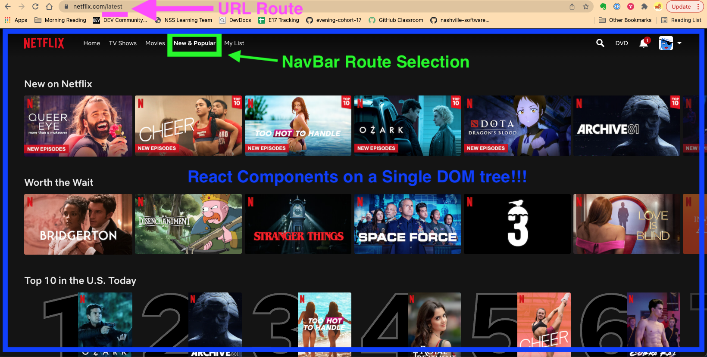
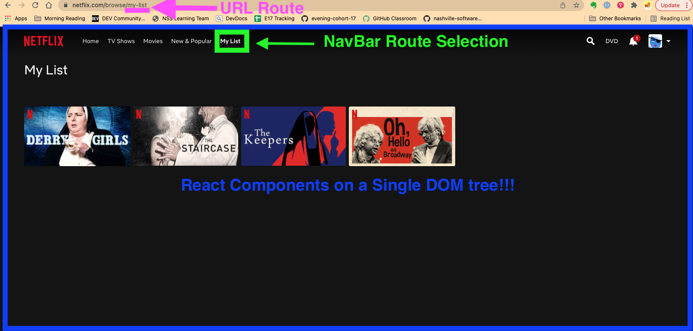

# Ch 7: Routing in React Applications

In a single page application, you are only rendering one DOM tree. You never request another HTML file but create/destroy components in the one you have. If you have multiple views in your application, a universal design pattern is to have a navigation element on the page for users to select and see different views.

In React, you will use something called a Router to handle the rendering of different components when the user clicks on navigation items. This also allows users to bookmark specific places within a single page app. See the examples below:
  
  

  
  


  


  
## Setup

Make sure you are in your project's root directory. First, we need to install `react-router-dom`. Then we will create an additional file to handle the routing and create a navbar.

Documentation for [react-router-dom](https://reactrouter.com/web/guides/quick-start)

```sh
npm i --save react-router-dom
touch src/ApplicationViews.js
mkdir src/components/nav
touch src/components/nav/NavBar.js
touch src/components/nav/NavBar.css
touch src/Home.js
```

## Making Your Components

Here's what we are about to do:

1. Create the **`NavBar`** component for the constant navigation elements
1. Create the **`ApplicationViews`** component. This will define all of the URLs your application will support and which views will be displayed for each one.
1. Change the **`Kennel`** component to display two child components.
1. Update the **`index.js`** to utilize `react-router-dom`.

### NavBar Component

Use this code for your navigation bar and the following CSS.

> ##### `src/components/nav/NavBar.js`

```js
import React from "react"
import { Link } from "react-router-dom"
import "./NavBar.css"

export const NavBar = () => {
    return (
        <ul className="navbar">
            <li className="navbar__item active">
                <Link className="navbar__link" to="/">NSS Kennels</Link>
            </li>
            <li className="navbar__item">
                <Link className="navbar__link" to="/locations">Locations</Link>
            </li>
            <li className="navbar__item">
                <Link className="navbar__link" to="/animals">Animals</Link>
            </li>
            <li className="navbar__item">
                <Link className="navbar__link" to="/customers">Customers</Link>
            </li>
            <li className="navbar__item">
                <Link className="navbar__link" to="/employees">Employees</Link>
            </li>
        </ul>
    )
}
```

> ##### `src/components/nav/NavBar.css`

```css
.navbar {
    display: flex;
    flex-wrap: nowrap;
    justify-content: left;
}

.navbar__item {
    flex-basis: 20%;
    list-style-type: none;
}
```

Notice the use of the `<Link/>` component. This comes from the React Router package you installed. It has an attribute named `to`. It will render a hyperlink in your DOM, and when clicked, it will change the URL in the browser to the value of the `to` attribute.

### Defining the Routes of the Application

Now it's time to define the Routes for our application. In **`NavBar`**, you defined four **`<Link />`** components that will navigate to the routes of...

* `/`
* `/locations`
* `/animals`
* `/customers`
* `/employees`

In the **`ApplicationViews`** component, you will define how your application will respond when the URL matches each of those patterns. When a user clicks on one of the hyperlinks in the navigation bar, this code dictates which component should be rendered.

### Home Component

Use this code for your homepage that will be displayed when navigating to the route of `/`.

> ##### `src/components/Home.js`
```jsx
import React from "react";
import { PropsAndState } from './components/PropsAndState'

export const Home = () => (
    <>
        <h2>Nashville Kennels</h2>
        <small>Loving care when you're not there.</small>

        <address>
            <div>Visit Us at the Nashville North Location</div>
            <div>500 Puppy Way</div>
        </address>
        <PropsAndState yourName={"Brenda"} />
    </>
)
```

> ##### `src/components/ApplicationViews.js`

```jsx
import React from "react"
import { Route, Routes } from "react-router-dom"
import { Home } from "./Home"
import { AnimalCard } from './components/animal/AnimalCard.js'


export const ApplicationViews = () => {
    return (
        <>
            <Routes>
                {/* Render the location list when http://localhost:3000/ */}
                <Route exact path="/" element={<Home />} />

                {/* Render the animal list when http://localhost:3000/animals */}
                <Route path="/animals" element={<AnimalCard />} />
            </Routes>
        </>
    )
}
```

`exact` is needed on the first route, otherwise it will also match the other routes, and the **`Home`** will render for every route.

The `<Link/>` and the `<Route/>` JSX elements are complementary to each other. If you add a new **`Link`** element in your application with a new URL, then you must create a matching **`Route`** element.

### Updating the Kennel Component

As mentioned above, **`Kennel`** is a container component. It renders no HTML itself. It simply *contains* other components that are responsible for the presentation and behavior of the application. In the case of our Kennel, it contains two different kinds of components.

1. **`NavBar`**: This is a _Presentation Component_. Directly expresses HTML.
2. **`ApplicationViews`**: This is a _Controller Component_. Its only responsibility to to control the behavior of the system and maps URLs to components.

> ##### `src/components/Kennel.js`

```js
import React from "react"
import { NavBar } from "./nav/NavBar"
import { ApplicationViews } from "../ApplicationViews"
import "./Kennel.css"

export const Kennel = () => (
    <>
        <NavBar />
        <ApplicationViews />
    </>
)
```

Now update your `index.js` by adding a root component of `<Router />` which gets imported from the React Router package. Within **`<Router>`**, place the `<Kennel />` child component. This tells React *"I will be placing Routes in my Kennel component."*

> ##### `src/index.js`

```js
import React from "react"
import ReactDOM from "react-dom"
import { BrowserRouter as Router } from "react-router-dom"
import { Kennel } from "./components/Kennel.js"
import "./index.css"

ReactDOM.render(
    <React.StrictMode>
        <Router>
            <Kennel />
        </Router>
    </React.StrictMode>,
    document.getElementById("root")
)
```

With code in place, you should be able to navigate between multiple views and display different HTML representations.

## Practice: Locations, Customers and Employees

Your job is to update **`ApplicationViews`** to make the _Locations_, _Customers_ and _Employees_ links display their matching resources when clicked. You will to display the respected component for each view.

[Return  to Book 6's Table of Contents](../README.md)

[Ch 8: Loading Data from an API](./REACT_LOADING_DATA.md)
